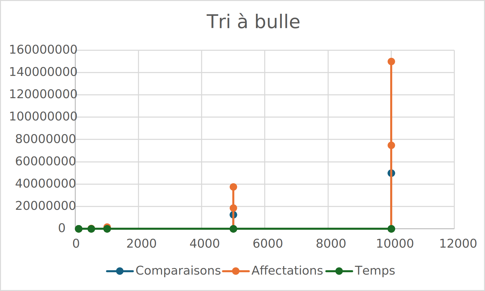
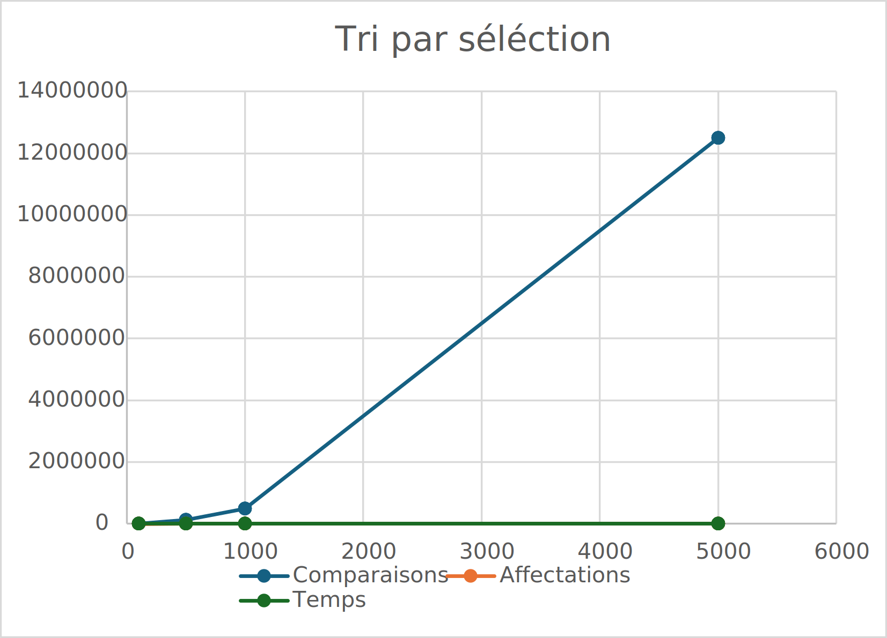
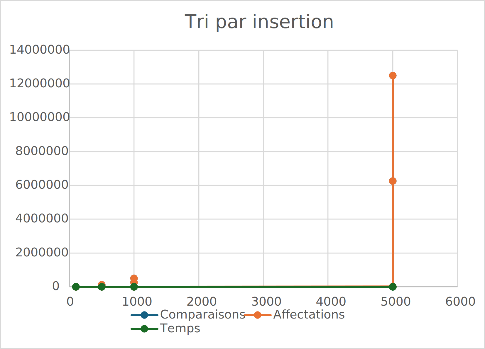
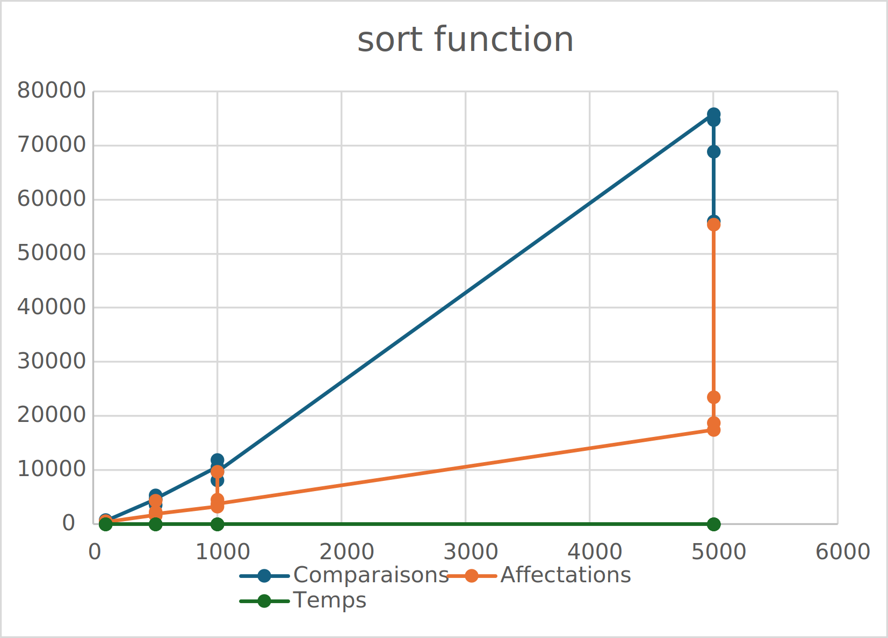
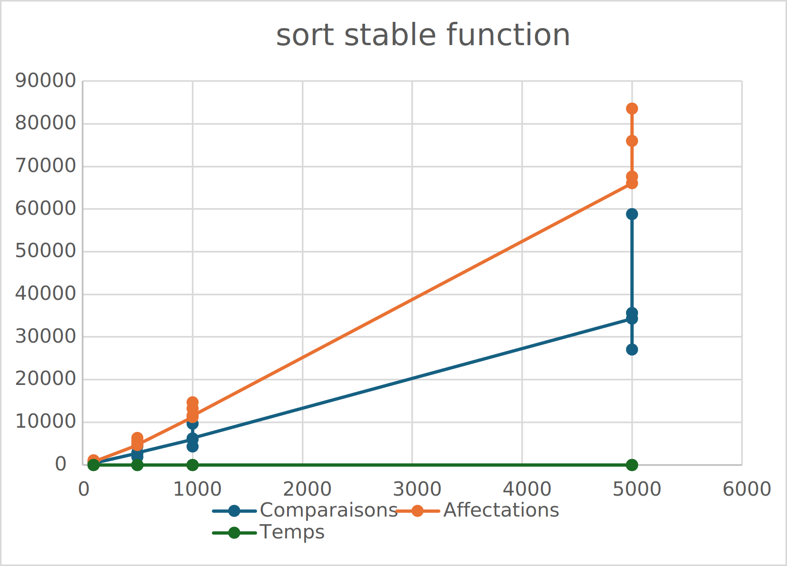

# L1 - Complexité

### Objectif
Le but premier de ce labo est de nous faire revoir les algorithmes de tri simples vus en PRG1 ainsi que découvrir ceux de la STL `std::sort` et `std::stable_sort`.

Deuxièmement, on cherchera à analyser les différents tris en prenant compte de certaines mesures comme : leur nombre de comparaisons, leur nombre d'affectations et leur temps de calcul.

Finalement, on cherchera à définir s'il existe un meilleur tri qu'un autre et on cherchera à établir si ces mesures restent constantes indépendamment des entrées fournies.
### Le labo
Dans un premier temps, nous avons conçu des méthodes simulant les algorithmes de tri à bulles, tri par sélection et tri par insertion.

Deuxièmement, nous avons créé une fonction générique générant des vector<T> pouvant avoir comme argument générique T, un type numérique de C++ pour mesurer le temps d'exécution ou un type OpCounter nous permettant de mesurer le nombre d'opérations.

Cette fonction crée les entrées suivantes :
- Une entrée triée dans l'ordre croissant
- Une entrée triée dans l'ordre décroissant
- Une entrée complètement aléatoire
- Une entrée presque triée

Nous avons également créé un programme qui nous permet de calculer le temps nécessaire pour trier les entrées précédentes. un deuxième qui tient compte du nombre de comparaisons et d'affectations. De plus, la classe OpCounter est utilisée pour déterminer le nombre d'opérations pertinentes (comparaisons et affectations).

Nous avons utiliser comme nombre de valeur dans le vecteur ```vector<int> sizes = {100, 500, 1000, 5000, 10000};```

### Résultats
#### Nombre de comparaisons
##### Entrée triée par ordre croissant 

InsertionSort = BubbleSort < std::stable_sort < std::sort < SelectionSort

##### Entrée triée par ordre décroissant
std::stable_sort < std::sort < SelectionSort = InsertionSort = BubbleSort

##### Entrée aléatoire
std::stable_sort < std::sort < InsertionSort < SelectionSort = BubbleSort

##### Entrée presque triée
std::stable_sort < std::sort < InsertionSort < SelectionSort = BubbleSort

#### Ce que on peut en dire
Nous pouvons constater que le nombre de comparaisons faites par SelectionSort a une complexité de n^2 indépendamment du type d'entrée qui lui est fourni.

En revanche, le BubbleSort et InsertionSort trouvent un nombre de comparaisons similaire de n lorsque l'entrée est déjà triée.

Néanmoins, ils retrouvent tous les trois un nombre de comparaisons de n^2 lorsque l'entrée est en ordre décroissant, aléatoire ou partiellement triée.

En ce qui concerne les tris de la STL, le nombre de comparaisons de n*log(n)
reste également constant dans tous les cas.

#### Nombre d'affectations
##### Entrée triée par ordre croissant

  Aucune affectation de Bubble Sort et Insertion </br>
  SelectionSort < std::sort < std::stable_sort


##### Entrée triée par ordre décroissant
  
  SelectionSort < std::sort < std::stable_sort < InsertionSort = BubbleSort


##### Entrée aléatoire
  
  SelectionSort < std::sort < std::stable_sort < InsertionSort = BubbleSort


##### Entrée presque triée
  
  SelectionSort < std::sort < std::stable_sort < InsertionSort = BubbleSort
  

#### Ce que on peut en dire 
Lorsque l'entrée est complètement triée, nous pouvons voir que BubbleSort et InsertionSort ne font aucune affectation. Cependant, SelectionSort effectuera souvent des tâches sur le même endroit sans faire de comparaison.

En revanche, lorsque l'entrée est dans l'ordre décroissant ou aléatoire avec (n) affectations, SelectionSort est plus efficace que les autres. Contrairement aux tâches de BubbleSort et InsertionSort pour (n^2).

"std::sort" et "std::stable_sort" restent sur le même nombre d'affectations de!n*log(n) indépendamment du nombre de comparaisons.

#### Nombre d'opérations
##### Entrée triée par ordre croissant
  
  BubbleSort = InsertionSort < std::sort < std::stable_sort < SelectionSort


##### Entrée triée par ordre décroissant
  
  std::sort < std::stable_sort < SelectionSort < InsertionSort = BubbleSort


##### Entrée aléatoire
  
  std::stable_sort = std::sort < SelectionSort < InsertionSort < BubbleSort


##### Entrée presque triée
  
  std::sort < std::stable_sort < SelectionSort = InsertionSort < BubbleSort
  
#### Ce qu'on peut en dire
Le nombre d'opérations rejoint ce que nous avons constaté jusqu'à maintenant.

#### Temps de calcul
##### Entrée triée par ordre croissant
  
  BubbleSort = InsertionSort < std::sort = std::stable_sort < SelectionSort


##### Entrée triée par ordre décroissant
  
  std::sort = std::stable_sort < BubbleSort = InsertionSort = SelectionSort


##### Entrée aléatoire
  
  std::sort = std::stable_sort < BubbleSort = InsertionSort = SelectionSort


##### Entrée presque triée
  
  std::sort = std::stable_sort < InsertionSort <= BubbleSort = SelectionSort
  #### Ce qu'on peut en dire 
Le temps de calcule depend fortement de l'ordinateur sur lequelle on fait tourner le tris donc ce n est pas une tres bonne mesure mais on constate que les écarts de temps s'accentuent à mesure que le nombre d'éléments augmente.


#### Les différents graphiques






### En conclusion
Les tris que nous avons implémenter ne sont pas dutout efficaces mise a part dans certaines conditions ou ils sont les plus rapide (mais c est rare) et donc on constate  que std::sort et std::stable_sort sont beaucoup plus performant, car leurs algorithmes sont beaucoup plus sophistiqués que les choses que nous avons pu créer.  