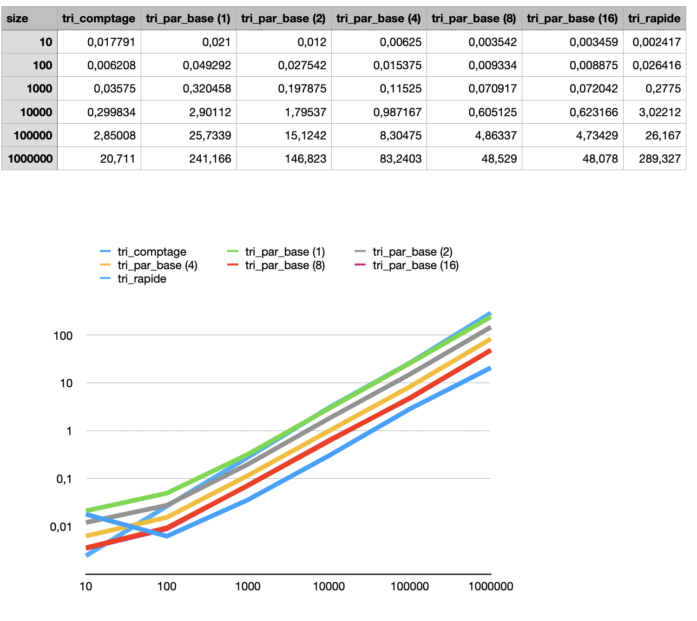

# L3 - Tris

## Objectif
Le but de ce labo est de mettre en place les algorithmes du tri par base, du tri rapide et du tri comptage.

Par la suite, on devra comparer le temps de tri des algorithmes avec différentes tailles de tableau. 
Pour définir lequel est le plus rapide dans différentes situation.

## Labo
Pour commencer, nous avons mis en place les différents algorithmes dans les 2 fichiers .h fournis.
Ensuite, nous avons créé deux fichiers main un pour tester que les tris fonctionnaient bien et un 
pour tester le temps que les méthodes prennaient pour trier le vecteurs fournis en paramètre.

Par la suite, nous avons effectué plusieurs fois le main qui nous donne le temps de la méthode, 
afin d'en faire une moyenne pour chaque tri et de pouvoir les comparers dans un graphique.

Chaque tri est testé avec différentes tailles (10, 100, 1'000, 10'000, 100'000, 1'000'000)

## Complexiter 
### Tri rapide
#### Compléxité temporelle théorique
- Pire cas : O(n2)
- Cas moyen : O(n*log(n))
- Meilleur cas : O(n*log(n))
### Tri par base
#### Compléxité temporelle théorique
- Pire cas : O(w*n)
- Cas moyen : O(w*n)
- Meilleur cas : O(w*n)

## Analyse
Ce que l'on voit c'est que le tris comptage est le plus efficace puis tout les tris par base et enfin le tris rapide 

Les algorithmes de tris ont une évolution et des complexités très similaires, comme le montrent les données et les graphiques. Néanmoins, le tri par base, quelle que soit la base utilisée, est généralement plus rapide que le tri rapide.

Il est important de noter que le tri par base (8) a un jeu de données très similaire au tri par base (16), ce qui est logique car, étant donné que les valeurs sont traitées sur des octets, travailler sur un ou deux octets est beaucoup plus rapide que de travailler sur des parties d'octets, comme le feraient les tris par base (1), (2) et (4).

Il est important de noter que dans les tableaux avec peu d'éléments, le tri rapide est plus efficace que certains tri par base, bien qu'il puisse être surclassé rapidement.

Le tri par base utilise plusieurs fois le tri comptage, il est donc logique qu'un tri qui l'utilise plusieurs fois prenne moins de temps qu'un tri qui l'utilise une seule 