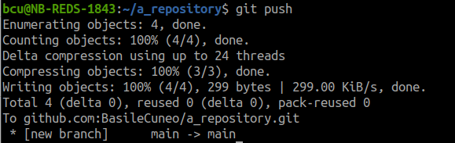
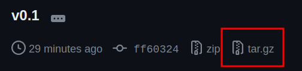

# PRG2 L1 - Introduction et prise en main

Le but de ce laboratoire est de prendre en main les différents outils nécessaires au bon déroulement des futurs laboratoires, ainsi que d'exercer la compilation, l'exécution et le debug de programmes simples via le terminal. La procédure de rendu du travail effectué sera également abordée.

## Utilisation de VS Code

Visual Studio Code est un environnement de développement gratuit permettant de prendre en main très facilement un grand nombre de projets, dans toutes sortes de langages. De nombreuses extensions pouvant être installées d'un simple clic permettent de prendre en charge (presque?) toutes les fonctionnalités dont vous pourriez avoir besoin.

Vous pouvez trouver VS Code dans les applications installées dans votre VM et le lancer manuellement, mais nous allons aborder ici une autre façon de faire. Dans un terminal, la commande `code /mon/chemin/d/acces` permet d'ouvrir directement VS Code avec comme workspace le répertoire donné à la commande. Par exemple, si nous avons un projet nommé `my_project` stocké sur le bureau sur lequel nous souhaitons travailler, il suffit de procéder de la façon suivante:

Ouvrir un terminal avec `Ctrl + alt + t`, puis saisir les commandes suivantes:
```sh
cd ~/Desktop/my_project 
code . # dans un terminal Linux, le "." fait référence au répertoire courant
```

ou alors 

```sh
code ~/Desktop/my_project
```

VS Code doit alors s'ouvrir et le workspace correspond au contenu du répertoire `my_project`.

Dans la partie supérieure gauche, vous trouverez par défaut 5 onglets.

Le premier onglet donne accès à l'explorateur de fichiers, vous y trouverez l'arborescence de fichiers de votre workspace.


Le second onglet consiste en un outil de recherche plus poussé qu'un simple `Ctrl + f`, car il permet de rechercher un pattern dans le workspace entier et pas seulement dans le fichier actuel. Dans cet onglet, les trois petits points permettent d'afficher plus d'options de filtrage pour la recherche.


Le troisième onglet donne accès à une interface graphique pour la gestion de git. Néanmoins, nous vous encourageons à adopter l'utilisation de git via lignes de commandes que nous verrons plus tard.


Le quatrième onglet est l'outil de debug intégré à VS Code. Nous reviendrons sur son utilisation plus tard dans l'énoncé.


Finalement, le 5ème onglet donne accès au menu des extensions, c'est ici que vous pourrez trouver toutes les extensions dont vous pourriez avoir besoin pour faciliter votre travail.


De plus, dans VS Code, il est possible d'utiliser la commande `Ctrl + shift + ^` pour ouvrir un terminal interne à l'IDE, cela permet d'éviter de changer de fenêtre pour accéder à un terminal.

## Extension utilisée

Nous utiliserons l'extension C/C++ de Microsoft. Pour cela, allez dans le menu des extensions et chercher `C/C++` et installez l'extension Microsoft. (Sur l'image suivante, seule la première extension à besoin d'être installée.) Cette extension permet d'ajouter la possibilité de debug de code C ainsi que le formatage de celui-ci.


## Ajout des règles de formatage

Pour les laboratoires, nous allons suivre des règles de style de code. Ces règles peuvent être ajoutées à VS Code grâce à l'extension `C/C++`. Pour cela, allez dans les paramètres de VS Code (`File -> Preferences -> Settings`), assurez-vous d'avoir les paramètres utilisateur sélectionnés et pas de l'espace de travail (`workspace`), puis cliquez sur l'icône de fichier en haut à droite. Un fichier JSON devrait s'ouvrir.


Copiez ensuite les lignes suivantes dans le fichier, (si le fichier contient déjà des valeurs, il faut simplement ajouter celles-là à la suite) :

```json
{
    "C_Cpp.formatting": "vcFormat",
    "C_Cpp.vcFormat.newLine.beforeOpenBrace.function": "sameLine",
    "C_Cpp.vcFormat.newLine.beforeOpenBrace.block": "sameLine",
    "C_Cpp.vcFormat.newLine.beforeOpenBrace.lambda": "sameLine",
    "C_Cpp.vcFormat.newLine.beforeOpenBrace.namespace": "sameLine",
    "C_Cpp.vcFormat.newLine.beforeOpenBrace.type": "sameLine",
    "C_Cpp.vcFormat.newLine.beforeWhileInDoWhile": true,
    "C_Cpp.vcFormat.space.pointerReferenceAlignment": "right",
    "C_Cpp.vcFormat.newLine.beforeElse": false,
    "files.insertFinalNewline": true,
    "editor.tabSize": 4,
    "editor.formatOnSave": true,
}
```

Le dernier paramètre indique à VS Code que les fichiers doivent être formatés dès que le fichier est sauvegardé. Cette ligne peut être supprimée, auquel cas, le formatage devra être lancé manuellement en faisant `clique droit -> Format Document`.

## Compilation et exécution d'un programme simple

Nous allons maintenant voir comment compiler et exécuter un programme simple. Dans un terminal, rendez-vous dans le répertoire `simple_program`, vous y trouverez un fichier `main.c` contenant un programme très simple. 

Afin de compiler ce programme, l'outil GCC va être utilisé. C'est un outil comprenant un grand nombre de paramètres, mais nous n'allons pas toutes les aborder. Néanmoins, si vous voulez en apprendre plus sur GCC, vous pouvez taper la commande `man gcc` dans un terminal pour avoir accès à la documentation complète de cet outil. 

Dans notre cas, GCC va être utilisé de manière simple selon le pattern de commande suivant:

```
gcc <fichiers .c à compiler> -o <nom de l'exécutable> -Wall
```

Le flag `-Wall` permets d'afficher tous les warnings pour les potentiels problèmes du code à la compilation.

Dans le cas de cet exemple de code, la commande à saisir est donc:

```
gcc main.c -o main -Wall
```

Cela va compiler le fichier `main.c` et donner un exécutable nommé `main`. Pour exécuter celui-ci, il suffit d'exécuter la commande suivante:

```sh
# depuis le répertoire simple_program
./main
```

Le message `Hello World!` devrait alors s'afficher.

## Compilation et exécution d'un programme utilisant plusieurs fichiers sources

Vous trouverez dans le répertoire `multi_files` un programme `main.c` faisant appel à une fonction provenant de la librairie (très simple) `a_simple_lib` correspondante aux fichiers `a_simple_lib.c` et `a_simple_lib.h`. 

Pour compiler ce programme, il faut donc inclure `a_simple_lib` dans la liste des fichiers à compiler. Dans la commande gcc, seuls les fichiers au format `.c` doivent être renseignés.

Les commandes pour compiler et exécuter ce programme sont donc:

```
gcc main.c a_simple_lib.c -o main -Wall
./main
```

Deux messages devraient alors apparaître, un premier message venant de `main.c` et un second venant de la fonction `print_hello_world` venant de la librairie `a_simple_lib`.

## Configuration du debugger dans VS Code

Afin de configurer le debugger de VS Code, des fichiers au format `JSON` sont nécessaires. Plusieurs façons de faire existent, mais la plus simple est d'utiliser un fichier `launch.json` appelé au démarrage du débugger qui va lui-même appeler un fichier nommé `tasks.json` dans lequel les commandes à utiliser pour la compilation et l'exécution sont listées.

Pour que le debugger puisse fonctionner, il faut impérativement que le workspace courant de VS Code soit la racine de votre répertoire de laboratoire. Par exemple, dans le cadre de ce laboratoire, le workspace utilisé doit être `lab01`. De plus, les deux fichiers doivent impérativement se trouver dans un répertoire nommé `.vscode` se trouvant à la racine du workspace (ici, à la racine de `lab01`).

Le workspace pour utiliser le debugger dans ce laboratoire devrait donc ressembler à cela:


Le contenu du fichier `launch.json` permet de décrire une configuration pour chaque programme à debugger. Ce fichier vous a été fourni avec une configuration unique permettant de debugger le programme présent dans le répertoire `simple_debug`. Vous pourrez ensuite en ajouter une autre pour le programme `error_debug.c`. Chaque configuration possède plusieurs champs importants à modifier en fonction des besoins, nous aborderons uniquement ceux que vous devez modifier en fonction du programme à debugger:

* name : définis le nom de votre configuration de debug, ce qui permettra ensuite de la sélectionner pour la démarrer
* program : représente le chemin d'accès vers l'exécutable à debugger
* args : permet d'ajouter des arguments au lancement de l'exécutable, au même titre qu'en lançant l'exécutable en ligne de commande avec `./executable arg1 arg2 arg3`
* cwd : dois correspondre au répertoire dans lequel se trouve l'exécutable à debugger
* preLaunchTask : permets de faire le lien avec les tâches de compilation se trouvant dans le fichier `tasks.json`. Ces tâches s'exécutent au lancement du debug, pour pouvoir par exemple build l'exécutable debuggable.

Pour ajouter une nouvelle configuration, il faut ajouter une virgule après l'accolade fermante de la configuration déjà existante, puis en reconstruire une autre entre accolades.

Dans le fichier `tasks.json`, une tâche doit être déclarée pour chaque configuration, le `label` de cette tâche doit correspondre à celui donné dans la configuration correspondante. Pour ajouter une nouvelle tâche, il faut procéder de la même manière que pour ajouter une configuration dans le fichier `launch.json`. Dans les tâches, la commande utilisée est `gcc`, puis les arguments sont listés. Le but est de donner tous les arguments pour reconstruire la commande de compilation du programme. Par exemple, dans la tâche correspondante au projet `simple_debug`, la commande reconstituée est:

```
gcc main.c -g -o main -Wall
```

Nous pouvons constater que le flag `-g` a été ajouté à la commande vue plus tôt. Ce flag permet d'ajouter à la compilation des éléments permettant au debugger de faire les liens entre l'exécution du programme et les points d'arrêts posés ainsi que les états des variables. Sans ce flag, le debugger ne pourrait ni s'arrêter sur les points d'arrêts, ni afficher l'état du programme.

Le champ `cwd` doit aussi renseigner le répertoire dans lequel se trouve le projet à debugger.

Un commentaire dans le fichier `tasks.json` vous permet de savoir où ajouter des fichiers dans le cas d'un programme basé sur plusieurs fichiers sources. Libre à vous d'adapter ce fichier en fonction de vos besoins pour les prochains projets abordés dans ce cours!

## Utilisation du debugger sur un programme fonctionnel

Afin de valider le bon fonctionnement du debugger, vous allez maintenant pouvoir l'utiliser sur le projet `simple_debug`. Pour y parvenir, ouvrez VS Code avec le répertoire `simple_debug` en workspace. Dans le fichier `main.c`, placez un ou plusieurs points d'arrêts à des endroits pouvant être intéressants (par exemple, à l'intérieur de la boucle). Pour ajouter un point d'arrêt, il suffit de cliquer à gauche du numéro de ligne. Rendez-vous ensuite dans l'onglet `Run & Debug` dans le menu de gauche. 

Vous devriez alors voir apparaître un bouton `play` vert apparaître à côté du nom de la configuration: `(gdb) Debug`. Cliquez sur ce bouton. 


L'exécution du programme doit alors démarrer, puis s'arrêter sur le premier point d'arrêt rencontré. Une fois le programme en pause, la ligne courante est mise en surbrillance en jaune.


Vous pouvez alors observer l'état des différentes variables dans la partie gauche de la fenêtre.


Un petit pannel avec 6 boutons doit également être apparu: 


Les boutons donnent accès aux fonctionnalités suivantes:

* Continue / pause: permets de reprendre l'exécution du programme jusqu'au prochain point d'arrêt, ou de mettre en pause celui-ci (si en cours d'exécution).
* Step Over: permets d'avancer d'une instruction dans le programme, sans que le debugger entre dans les fonctions rencontrées (exécute la fonction, mais ne debug pas son contenu).
* Step Into: permets au debugger d'entrer à l'intérieur de la fonction sur laquelle l'exécution est arrêtée.
* Step Out: permets au debugger de sortir de la fonction en cours de debug.
* Restart: redémarre l'exécution du programme.
* Stop: arrête et quitte le debugger.

De plus, en bas de l'écran, vous pouvez sélectionner l'onglet `Terminal` pour avoir accès au terminal du programme et donc aux affichages (`printf`), ainsi qu'aux inputs utilisateur. 


Prenez le temps de bien explorer ces différents menus.

## Utilisation du debugger sur un programme non fonctionnel

Vous trouverez dans le répertoire `error_debug` un programme qui compile sans erreur ni warning, mais qui rencontre des problèmes à l'exécution (Segmentation fault). A vous de mettre en place la configuration du debugger pour ce programme et d'utiliser le debugger pour trouver la ou les erreurs. 

Certaines instructions utilisent des notions que vous n'avez pas encore abordées en cours, il ne vous est pas demandé de les comprendre (vous pouvez néanmoins essayer de les comprendre!). Simplement d'identifier les lignes posant problème et de les commenter. 

Nous vous conseillons vivement d'effectuer ces recherches à l'aide du debugger pour vous exercer et non de chercher directement les erreurs dans le code.

## Procédure de rendu des laboratoires

Pour le rendu des laboratoires, vous devez procéder de la façon suivante:

* push des différentes modifications sur votre repos git
* création d'un tag git à la fin de votre travail 
* téléchargement de l'archive correspondant au tag
* remise de l'archive sur Cyberlearn

Voici un rappel des commandes élémentaires de git:

La commande `git status` permet d'observer les fichiers ayant été modifiés par rapport à la version courante sur le repos git, affiche également si les fichiers ont été ajoutés (en vert) ou non (en rouge) au commit actuel.


La commande `git add <file>` permets d'ajouter un fichier au commit actuel.


Il est également possible d'ajouter directement un répertoire grâce à la commande `git add`.


Vous n'êtes bien entendu pas obligés d'ajouter tous les fichiers modifiés à votre commit, si cela n'est pas nécessaire. Les exécutables obtenus lors des compilations ne sont par exemple pas utiles à ajouter à vos commits.

Si vous avez par erreur ajouté un fichier non désiré à un commit, vous pouvez utiliser la commande `git reset` qui fonctionne exactement à l'inverse de `git add`.

Une fois tous les fichiers voulus inclus dans le commit, vous pouvez créé votre commit avec la commande `git commit "message de commit"`. 


Vous pouvez ensuite push votre commit sur votre repository à l'aide de la commande `git push`.



Pour créer un tag, la commande `git tag -a <nom du tag> -m "message du tag"` doit être utilisée. La commande `git tag` permet ensuite de vérifier que le tag a bien été créé. Finalement, il suffit de push votre tag grâce à la commande `git push --tags`.


Afin de télécharger l'archive relative à votre tag, rendez vous sur la page Github de votre repos et cliquez sur le bouton `tag`.


Vous pouvez ensuite cliquer sur le bouton `tar.gz` pour télécharger l'archive à rendre.



Il ne vous reste plus qu'à déposer sur Cyberlearn l'archive obtenue!
