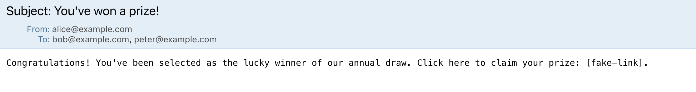

# Prank Mailer - SMTP Client  

Welcome to the **Prank Mailer** repository! This project is a Java application that generates prank email campaigns. It uses a configurable SMTP server to send emails, making it an excellent tool for understanding the SMTP protocol or for having fun with harmless email pranks.

---

## Project Overview  

The **Prank Mailer** is a Java application designed for educational purposes. It simulates prank email campaigns by automatically sending batches of pre-configured emails to groups of recipients.  

### Features:
- Dynamically create groups of victims from a list of email addresses.  
- Randomly select prank messages to be sent.  
- Communicate with an SMTP server to send emails.  
- Support for a mock SMTP server (e.g., [MailDev](https://maildev.github.io/maildev/)) to ensure no real emails are sent during testing.  

---

## Setting up a Mock SMTP Server  

To test the application without sending real emails, we recommend using **MailDev**, a simple and powerful mock SMTP server. Follow these steps:  

1. **Install & Start MailDev**:
   - Using `docker`:  
     ```bash
     docker run -d -p 1080:1080 -p 1025:1025 maildev/maildev
     ```

   MailDev will start a mock SMTP server on `localhost:1025` and a web interface on `http://localhost:1080`.

2. **Configure the application**:
   - In the `config.properties` file, set the following:
     ```properties
     smtpServer=localhost
     smtpPort=1025
     ```

3. **View received emails**:  
   Open `http://localhost:1080` in your browser to see the emails sent by the application.

---

## Configuring and Running a Prank Campaign  

Follow these steps to set up and run the prank campaign:  

### 1. Clone the Repository  
```bash
git clone https://github.com/EscapedGibbon/dai-lab-smtp.git
cd prank-mailer
```

### 2. Configure the Application  

Edit the following files:  

- **`config.properties`**:
  ```properties
  smtpServer=localhost
  smtpPort=1025
  groupCount=3
  ```

- **`victims.txt`**: Add the email addresses of your victims, one per line:
  ```plaintext
  alice@example.com
  bob@example.com
  charlie@example.com
  ```

- **`messages.txt`**: Define prank messages in the format below. Separate messages with `---`:
  ```plaintext
  Subject: You've Won a Prize!
  
  Congratulations! You've won a prize. Please reply with your bank details.
  ---
  Subject: Meeting Reminder
  
  Don't forget our meeting tomorrow at 9 AM!
  ```

### 3. Build and Run the Application  
Compile the program using Maven:  
```bash
mvn clean package
```
(**IMPORTANT**: run this command from the same folder where `pom.xml` file is located.)

and then execute the jar file from `target` folder with three compilation arguments:
 - filepath to config file
 - filepath to file with victim names
 - filepath to file with messages

In our case the command is:
```bash
java -jar ./target/smtp-client-1.0-SNAPSHOT.jar ../config.properties ../victims.txt ../messages.txt
```
Hoowever, you can use files from any folder, as long as they align with the file structure shown above.

The application will connect to the configured SMTP server and send the prank emails.

---

## Implementation Details  

### Key Classes  

#### **Class Diagram**  
  

#### **Descriptions**  
- **`Main`**: Entry point of the application. Manages initialization and error handling.  
- **`ConfigManager`**: Loads and validates configuration files, including the list of victims, messages, and SMTP server details.  
- **`Prank`**: Handles the creation of prank emails. Randomly groups victims and selects messages.  
- **`Email`**: Represents an email with sender, recipients, subject, and body.  
- **`SMTPClient`**: Manages the communication with the SMTP server, including connection, sending commands, and handling responses.  

---

### Example Dialogue Between Client and SMTP Server  

Below is a sample dialogue showing the interaction between the client and an SMTP server during an email transmission:

```plaintext
Connexion au serveur SMTP...
Connecté au serveur SMTP.
SERVER: 220 d9e482643dc7 ESMTP
CLIENT: EHLO localhost
SERVER: 250-d9e482643dc7 Nice to meet you, [172.17.0.1]
CLIENT: MAIL FROM:<alice@example.com>
SERVER: 250-PIPELINING
CLIENT: RCPT TO:<bob@example.com>
SERVER: 250-8BITMIME
CLIENT: RCPT TO:<peter@example.com>
SERVER: 250 SMTPUTF8
CLIENT: DATA
SERVER: 250 Accepted
E-mail envoyé au serveur SMTP.
SERVER: 250 Accepted
CLIENT: EHLO localhost
SERVER: 250 Accepted
CLIENT: MAIL FROM:<john.doe@example.com>
SERVER: 354 End data with <CR><LF>.<CR><LF>
CLIENT: RCPT TO:<claire@example.com>
SERVER: 250 Message queued as l571PYBn
CLIENT: DATA
SERVER: 250-d9e482643dc7 Nice to meet you, [172.17.0.1]
E-mail envoyé au serveur SMTP.
SERVER: 250-PIPELINING
CLIENT: QUIT
SERVER: 250-8BITMIME
Déconnexion du serveur SMTP...
Déconnecté du serveur SMTP.
```

---

### Screenshots  

#### MailDev Web Interface  
Emails sent by the application appear in MailDev’s web interface:  



---
