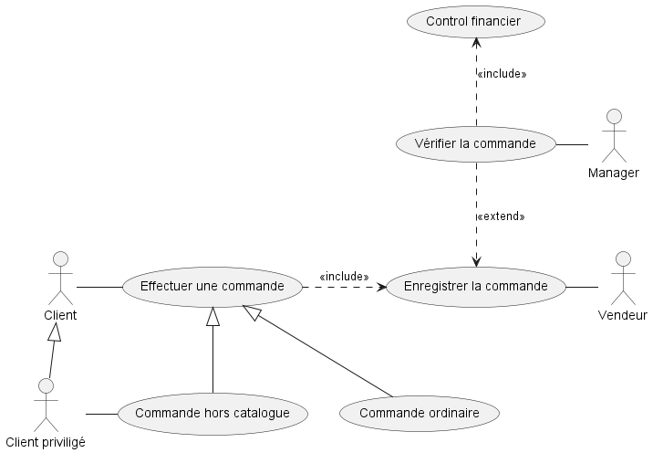

# Use case diagramme

## Vrai ou faux
Etant donné le diagramme de cas d’utilisation ci-dessus, les assertions suivantes sont-elles vraies ou fausses ? 
- Une commande ordinaire est enregistrée par le vendeur
- Une commande hors catalogue entraine un contrôle financier
- Un client peut effectuer une commande hors catalogue
- Le manager peut vérifier la commande sans effectuer de contrôle financier
- Un client privilégié peut effectuer une commande ordinaire

## Modifier le diagramme 
Comment modifier ce diagramme pour qu’un client non privilégié ne puisse effectuer de commande hors catalogue ?

