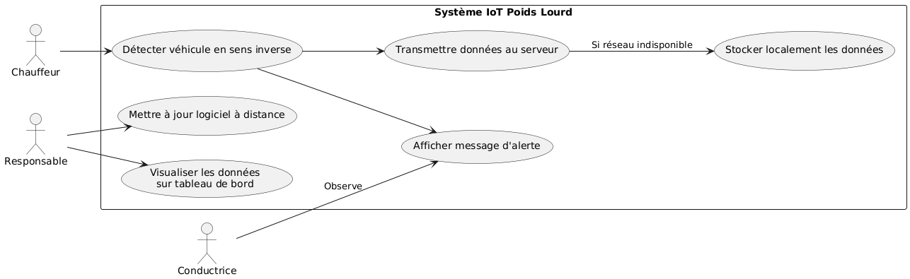
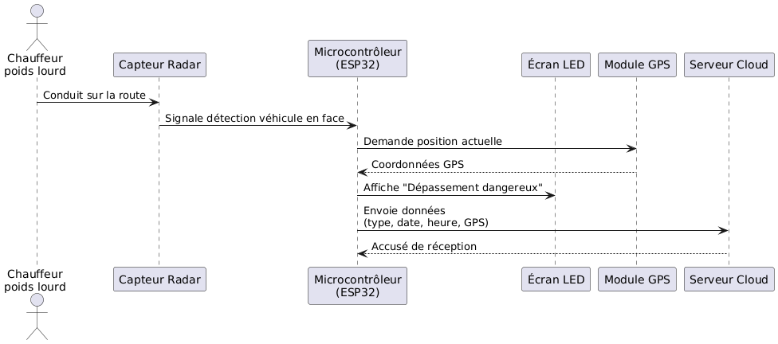

# Cahier des Charges – Système IoT de Prévention de Dépassements Dangereux

## Page de garde

**Nom du projet** : Système IoT de prévention de dépassements dangereux  
**Client** : Équipe pédagogique (Professeurs et assistants HEIG-VD)  

### Validation du document
- Prof. Hanna
- Assistant Reynaud
- Équipe projet : Benzekri, Fullemann, Racaj

---

## 1. Introduction

Chaque année en Suisse, des milliers d'accidents surviennent sur les routes, notamment lors de dépassements dangereux sur routes à double sens. Ce projet propose la conception d’un dispositif IoT embarqué sur les poids lourds permettant :
- d'alerter les véhicules suiveurs d’un danger potentiel lors d’un dépassement
- de collecter des données statistiques anonymisées sur ces événements

---

## 2. Périmètre d'application

Le système vise :
- les **véhicules lourds** (camions, autobus, tracteurs agricoles)
- les **routes cantonales et nationales** à double sens **sans séparation physique**

Le projet couvre :
- la **conception**
- le **prototypage**
- la **collecte & traitement des données**
- une **estimation de déploiement réel**

---

## 3. Description fonctionnelle

- Détection de véhicules en sens inverse
- Affichage dynamique à l’arrière du véhicule en cas de danger
- Transmission de données (nombre, durée, géolocalisation, heure) à un serveur sécurisé
- Stockage local temporaire en cas de coupure réseau
- Possibilité de mise à jour logicielle à distance

---

## 4. Besoins fonctionnels

 - La plateforme doit pouvoir être utilisée à partir de tout navigateur web, sans nécessiter l'installation de logiciels additionnels.

 - Elle doit centraliser la gestion et l’enregistrement des dispositifs déployés.

 - L’utilisateur doit pouvoir visualiser les données collectées, y compris les statistiques sur les dépassements à risque.

 - Une carte interactive devra afficher les emplacements des incidents avec des filtres (date, heure, type de véhicule, etc.).

 - Il doit être possible d’exporter les données au format CSV pour analyse externe.

 - L'accès doit être sécurisé par des identifiants personnels.

 - Des rôles d'utilisateurs doivent être définis pour limiter l'accès selon les droits de chacun.

 - Les administrateurs doivent pouvoir gérer les comptes utilisateurs et les dispositifs.

---

## 5. Exigences non-fonctionnelles

 - Protection des données : Assurer la confidentialité et la sécurité des informations conformément aux normes en vigueur.

 - Performance : Le système doit être capable de traiter un grand volume de données et d’utilisateurs sans perte de performance perceptible.

 - Ergonomie : L’interface doit être claire et facile à utiliser, avec une prise en main rapide. Un guide d’utilisation devra être fourni.

 - Disponibilité : Le service doit être opérationnel en continu, avec un taux de disponibilité minimum de 99,9%.

---

## 6. Spécifications techniques

- Capteur à détection frontale (caméra, lidar ou radar)
- Microcontrôleur avec connectivité (ESP32 ou équivalent)
- Affichage LED haute visibilité
- Module GPS intégré
- Transmission via 4G/5G ou LoRa selon disponibilité
- Alimentation sur batterie et alimentation véhicule

---

## 7. Documents applicables

- Fiches techniques des composants
- Normes de connectivité (IEEE, MQTT)
- Documentation projet HEIG-VD

---

## 8. Normes applicables

- Ordonnance sur les exigences techniques applicables aux véhicules routiers (OETV)
- RGPD pour les données collectées
- Normes CE pour les dispositifs électroniques embarqués

---

## 9. Choix technologiques

- **ESP32** : pour la connectivité, flexibilité et coût
- **Radar frontal** : robuste par mauvais temps
- **Affichage LED** : bonne lisibilité
- **Backend cloud** : Firebase ou Supabase

---

## 10. Contraintes techniques

- Résistance aux intempéries (IP65 minimum)
- Faible consommation énergétique
- Compatibilité électromagnétique
- Stabilité de la détection (faible taux de faux positifs)

---

## 11. Risques

- Incompatibilité avec certains modèles de camions
- Difficulté de calibration des capteurs
- Collecte incomplète en zones sans réseau
- Budget limité pour prototypage

---

## 12. Assurance Qualité (QA)

- Tests unitaires logiciels
- Simulation de scénarios de dépassement
- Tests terrain sur circuit sécurisé
- Revue de code et vérification électronique

---

## 13. Critères d’acceptation

- 90% de détection correcte
- Message d’alerte lisible à 30m
- Transmission des données < 30s après l’événement
- Stockage sécurisé et anonymisé

---

## 14. Plan de test

| Fonction     | Test                      | Vérification        | Validation                  |
|--------------|---------------------------|---------------------|-----------------------------|
| Détection    | Passage véhicule test     | Log capturé         | Taux de détection ≥ 90%     |
| Affichage    | Message danger activé     | Lisibilité à 30m    | Test utilisateur            |
| Transmission | Connexion au backend      | Réception des données | Retard ≤ 30s               |

---

## 15. Use Case diagramme

## 16. Diagramme de séquence

## 17. Ressources & Budget

### Équipe projet

- Chef de projet : étudiant référent  
- Ingénieurs dev : 3 étudiants  
- Validation : 1 étudiant  

### Estimations salariales (simulation)

| Rôle         | Salaire mensuel | Nombre | Total sur 3 mois |
|--------------|------------------|--------|------------------|
| Chef projet  | 2000 CHF         | 1      | 6’000 CHF        |
| Devs         | 1500 CHF         | 3      | 13’500 CHF       |
| Validation   | 1000 CHF         | 1      | 3’000 CHF        |
| **Total**    | —                | —      | **22’500 CHF**   |

### Autres coûts

- Expertise capteurs : 2’000 CHF  
- Déploiement test : 1’000 CHF  
- Logistique : 500 CHF  

### Matériel

| Composant       | Quantité | Coût unitaire | Total |
|------------------|----------|----------------|--------|
| ESP32            | 3        | 30 CHF         | 90 CHF |
| Radar            | 3        | 200 CHF        | 600 CHF |
| Écran LED        | 3        | 50 CHF         | 150 CHF |
| Autres (GPS, PCB)| —        | —              | 200 CHF |
| **Total**        | —        | —              | **1’040 CHF** |

---

## 18. Sécurité et Données

- Données anonymisées
- Transmission chiffrée (TLS)
- Respect du RGPD

---

## 19. Analyse des Données

- Backend avec API
- Dashboard Power BI ou équivalent
- Accès contrôlé aux données agrégées

---

## 20. Délais & Délivrables

| Période        | Activité principale                         |
|----------------|---------------------------------------------|
| Semaines 1-2   | Étude capteurs, maquette                    |
| Semaines 3-6   | Développement logiciel, intégration matérielle |
| Semaines 7-8   | Tests unitaires, transmission                |
| Semaines 9-10  | Tests terrain, validation                   |
| Semaine 11     | Rapport final, présentation                |

---
