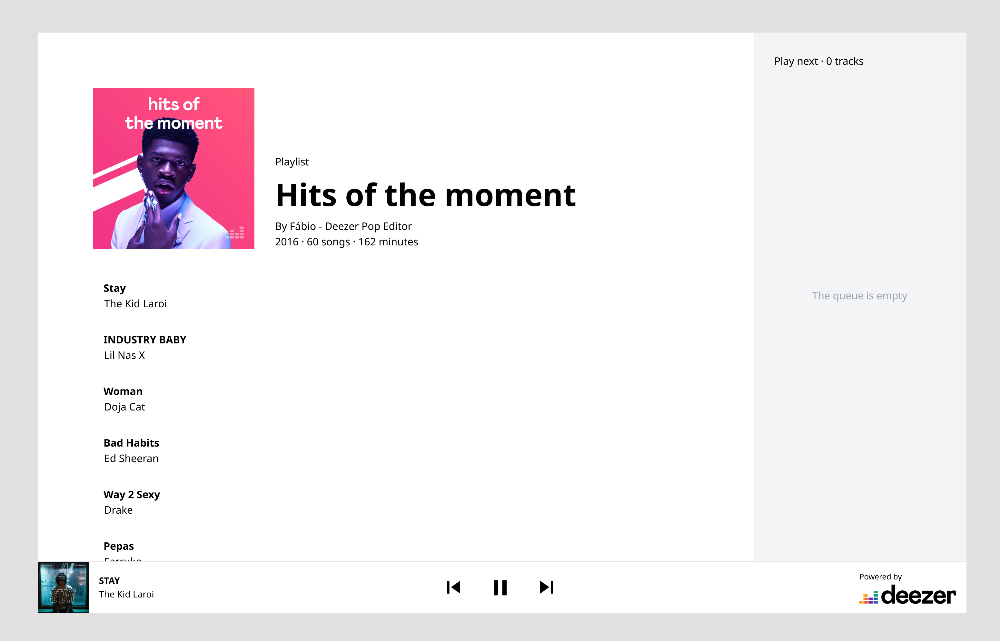

[](https://classroom.github.com/a/Ek2gkK4O)
# Prerequisites

- [Node 22](https://nodejs.org/en/download/) (LTS or older versions)

> We suggest you to use a version manager like [nvm](https://github.com/nvm-sh/nvm) to switch versions more easily.

# HTML & CSS

The idea of this lab is to practice with HTML and CSS by implementing a responsive web page based on a provided mockup.

## Objectives

Complete the HTML and CSS files in the `public` directory to make it look like the [Mockup](https://www.figma.com/file/J4VbVpfdcSPxtVzi94dTD5/Music-player?node-id=56%3A107) below.



## Rules

- CSS Frameworks are not allowed for this exercise.
- The `<main>` tag as well as all existing `id` attributes should not be changed because they are used for testing.
- Follow all the rules mentioned in the [Style guide](https://www.figma.com/file/J4VbVpfdcSPxtVzi94dTD5/Music-player?node-id=91%3A115) and [Guidelines](https://www.figma.com/file/J4VbVpfdcSPxtVzi94dTD5/Music-player?node-id=56%3A266): Colors, Typography, dimensions, spacing and positioning.
- The font and the normalized css have already been created and added to the index.html
- Please ask for help if you are stuck on a problem.

## Submission and Corrections

- We have set up some tests to check if your page is corresponding to the mockup.

## Local development setup

### Install dependencies

```sh
npm install
```

Ok, there is a lot of warnings, but you can ignore them.

### Run

Although you can directly open the [index.html](public/index.html) file with your browser and start coding, we advise you to use a development server such as [live-server](https://www.npmjs.com/package/live-server), which is a little development server written in Node.js with live reload capability.

Everything is already setup for you in [the package.json](package.json). To start the development server, you just need to run the following command:

```sh
npm run dev
```

Once started, the server will serve the files in the `public` directory and automatically reload the browser when you save any file.

### Run tests

> Make sure your development server has started before running tests.

We have made some tests with the library [cypress](https://www.cypress.io/).

You can locally run them with:

```sh
npm run cypress:open
```

To run them without opening the browser (headless testing):

```shell
npm run cypress:run
```

If Cypress does not work (the problem appeared in WSL), install the dependencies for cypress [dependencies](https://docs.cypress.io/guides/continuous-integration/introduction#UbuntuDebian):

```bash
apt-get install libgtk2.0-0 libgtk-3-0 libgbm-dev libnotify-dev libnss3 libxss1 libasound2 libxtst6 xauth xvfb
```

It's recommended to test your layout with Firefox to ensure you use the same browser as the one that will be used in the CI (it's Firefox in the CI) to verify your submission.

### Tips

On WSL, if cypress does not work, install the dependencies for cypress [dependencies](https://docs.cypress.io/guides/continuous-integration/introduction#UbuntuDebian):

```bash
apt-get install libgtk2.0-0 libgtk-3-0 libgbm-dev libnotify-dev libnss3 libxss1 libasound2 libxtst6 xauth xvfb
```

Make sure your development server has started before running tests.

Use Chrome or Firefox to test your layout.

Do not forget to push your modifications to GitHub. The GitHub
Actions will tell you if you passed all the tests.

The grading will be done by the GitHub Actions; if you pass all the tests, you
can be eligible for the full grade, but if we see some code that is too
complicated, we can reduce the grade.

<!-- You should not need more than one
`position: absolute` and you do not need to use `position: relative` for this
lab. -->

You can use `position:fixed` for the footer for example, although you can do without (with flexboxes only).

Do not use global styles, use classes and ids to style your elements.

```css
/* Bad */
body {
  font-family: 'Roboto', sans-serif;
}

/* Good */
/* CSS */
#main {
  font-family: 'Roboto', sans-serif;
}

/* HTML */
<body id="main"></body>
```

Look that the footer do not hide the playlist. Make it so it is sticky at the bottom of the page.

Always but text in a `p` or `span` tag, do not put text directly in a `div` or other tags. Except for the `h1` to `h6` tags.

Forbid the use of `!important` in your CSS.

The queue should keep its width when the screen is resized.

Do not only use classes to style your elements, use ids as well.

## Resources

- The Fonts used in the mockup have been loaded from https://fonts.google.com
- CSS Reference https://developer.mozilla.org/en-US/docs/Web/CSS/Reference
- HTML 5 sementic elements https://www.w3schools.com/html/html5_semantic_elements.asp

---

Happy coding 🤓 !
