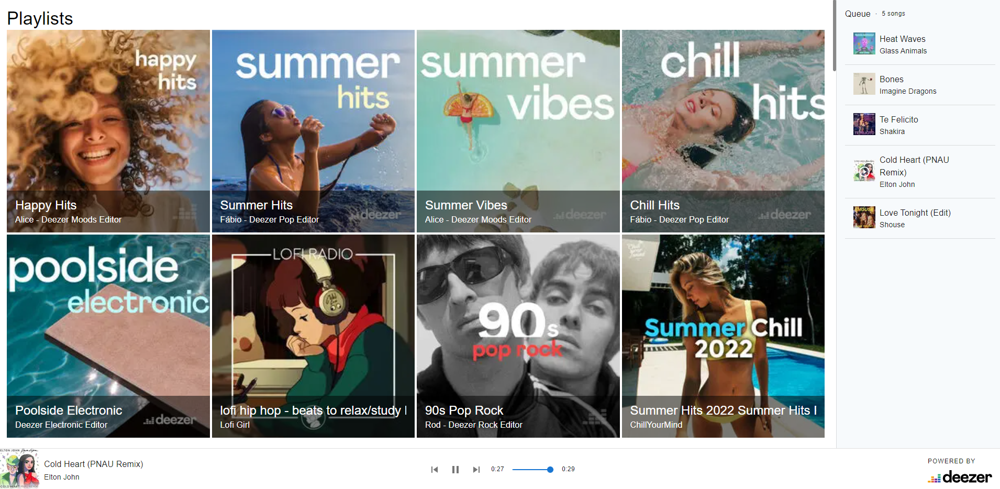
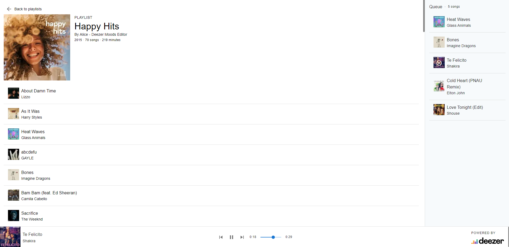

[](https://classroom.github.com/a/meZGbuKD)
# Labo 8

In this exercise, you'll practice with React, React Context, and MUI React component library by building a music player web application. The application will fetch Data from [Deezer Simple API](https://developers.deezer.com/api) and use the [HTML audio element](https://developer.mozilla.org/en-US/docs/Web/HTML/Element/audio) to play tracks in the browser.



*This is an illustration of how your app could look like. Do not take this as the expected result. You are only asked to implement the features listed in the requirements section below.*

## Requirements

Your application should meet the following requirements.

**Home page**

- It displays the 50 most popular playlists of Deezer. The title and cover image are displayed for each playlist.
- Users can click on a playlist to open the "Playlist detail" page.

**Playlist detail page**

- It displays general information for the current playlist: at least the cover image and the title.
- It displays the list of tracks. Each track should display the title, the artist, and the album cover image.
- Users can select a track to play.

**The player**

- The player stays visible on both pages and should not be interrupted when the user navigates from one page to another. You don't need to customize the browser's default controls such as pause/resume, seek, and volume.
- Additional controls should be added to play the "previous" and the "next" track. For this, you'll have to implement a "queue" mechanism. It's your choice to define the meaning of "next" / "previous" track. The state of the queue can be kept in memory, so you don't need to display its list of tracks.

**React Context**

React Context can be useful to manage and share the state between components. You can refactor the actions related to the states (such as play, pause, next...) in the context itself. 

> Use with caution : the components using Context are tightly coupled with the Context they use. 

**SWR**

For client side data fetching you might want to consider https://swr.vercel.app/. This is not mandatory.


## Deezer API

The [Deezer Simple API](https://developers.deezer.com/api) doesn't require any authentication; however, it has the following restrictions (which are totally fine for this exercise).

- Request rate limit: 50 requests / 5 seconds.
- The API returns only 30 seconds clips for each track.
- Cross-Origin Resource Sharing ([CORS](https://developer.mozilla.org/en-US/docs/Web/HTTP/CORS)) is not enabled, so you'll not be able to call the API directly from the browser with [fetch](https://developer.mozilla.org/en/docs/Web/API/Fetch_API) or SWR. The API is provided and included in the project under [/api](./api) folder. 

> If you plan to deploy this project, make sure to respect Deezer API [terms of use](https://developers.deezer.com/termsofuse).

### Popular playlists endpoint

Get 50 popular playlist from Deezer

https://api.deezer.com/chart/0/playlists?limit=50


### Single playlist endpoint

Get a playlist by id (908622995) and the list of tracks.

[https://api.deezer.com/playlist/908622995](https://developers.deezer.com/api/explorer?url=playlist/908622995)


## Project setup


Run the following command to install project dependencies in both `app` and `api` directories.

```sh
npm install
npm run start
```

## Evaluation

We will evaluate:

- That the [requirements](#Requirements) are fulfilled.
- Good seperation of your app in components.
- Quality of components, props and functions names.
- Avoid code duplication. (principe DRY (don't repeat yourself))
- No error in the browser console.


*Enjoy coding* 😊
